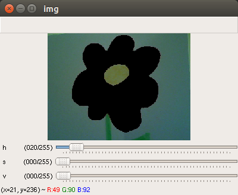
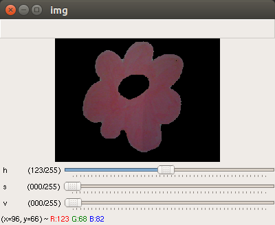
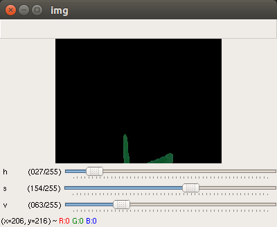

# Video stream color filterer (opencv)


## About

Frames grabbed from an RGB(BGR) stream are converted in HSV format. With the help of this application the right color space can be determined, useful for applications (i.e. skin filtering/detection) where a special color is needed to be tracked.

## Usage

From Command line:
```
python ./color_filterer.py
or 
python ./color_filterer.py 0
```
The first command-line argument defines the camera ID to use. By default, ID is zero, corresponds to the webcam connected to USB

## Output / Gui
Use "q" from the keyboard to exit from application.
<table>
<h1 align="left">
<tr>
  <th>
  <a name="flower" href=""></a>
  </th>
  <th>
  <a name="red part" href=""></a>
  </th>
  <th>
  <a name="green part" href=""></a>
  </th>
</tr>
</h1>
</table>


## Resources

[Original idea](https://opencv-python-tutroals.readthedocs.io/en/latest/py_tutorials/py_imgproc/py_colorspaces/py_colorspaces.html#converting-colorspaces) is part of the OpenCV python tutorials, credits go there.

/Enjoy.
